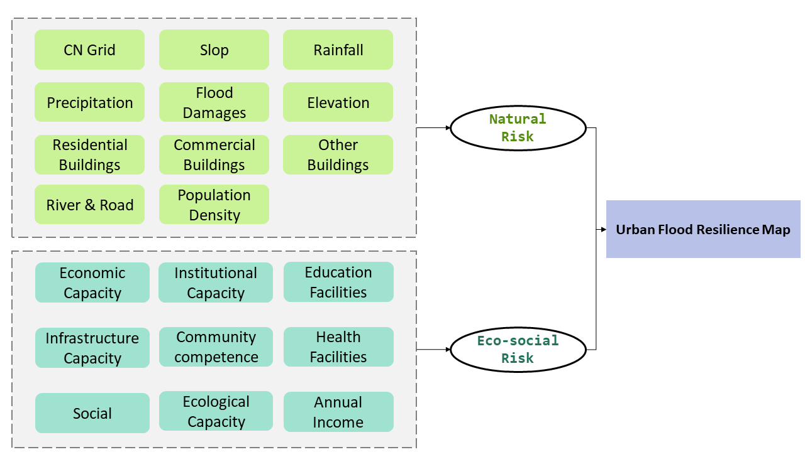

```{r setup, include=FALSE,echo=FALSE}
options(htmltools.dir.version = FALSE)
library(dplyr)
library(readr)
library(readxl)
library(knitr)
```

```{r xaringan-themer, include=FALSE, warning=FALSE}
library(xaringanthemer)
style_duo_accent(primary_color = "#0D5E74", 
                 # secondary_color = "#2881C6",
  header_font_google = google_font("Josefin Sans"),
  text_font_google   = google_font("Montserrat", "300", "300i"),
  code_font_google   = google_font("Fira Mono"),
)
```

```{r xaringan-all, echo=FALSE, warning=FALSE}
library(countdown)
library(xaringan)
library(xaringanExtra)
hook_source <- knitr::knit_hooks$get('source')
knitr::knit_hooks$set(source = function(x, options) {
  x <- stringr::str_replace(x, "^[[:blank:]]?([^*].+?)[[:blank:]]*#<<[[:blank:]]*$", "*\\1")
  hook_source(x, options)
})
xaringanExtra::use_broadcast()
xaringanExtra::use_freezeframe()
xaringanExtra::use_scribble()
#xaringanExtra::use_slide_tone()
xaringanExtra::use_search(show_icon = TRUE, auto_search	=FALSE)
xaringanExtra::use_freezeframe()
xaringanExtra::use_clipboard()
xaringanExtra::use_tile_view()
xaringanExtra::use_panelset()
xaringanExtra::use_editable(expires = 1)
xaringanExtra::use_fit_screen()
xaringanExtra::use_extra_styles(
  hover_code_line = TRUE,         
  mute_unhighlighted_code = TRUE  
)
```

```{r setupbibliography, include=FALSE}
# Code supplied by Andy (see wk2 slides 25-28)
library(RefManageR)
library(knitcitations)
BibOptions(check.entries = FALSE,
           bib.style = "authoryear",
           cite.style = "authoryear",
           style = "markdown",
           hyperlink = TRUE,
           dashed = FALSE,
           no.print.fields=c("doi", "url", "urldate", "issn"))
myBib <- ReadBib("references.bib",
                 # "./Bib.bib", 
                 check = FALSE)
```

class: center, title-slide, middle

background-image: url("img/rain1.jpg")
background-size: cover
background-position: center

# Beijing Floods & Resilience
## CASA0023<br/>Group Project
### Group: InspiriaQueens

### `r format(Sys.time(), "%d/%m/%Y")`

---

# Outline

<br/>
#### **1. Problem: Context & Background** — Qianyu Ren
#### **2. Policy** — Xingru Liu
#### **3. Case study, Approach & Methodology** - Yuqing Liu
#### **4. Plan** - Xiaoyi Chen
#### **5. Risks, Limitations & Summary** - Yihan Liu
#### **6. References**

---
class: inverse, center, middle

# 1. Problem: Context & Background

---
class: center, middle

## Beijing was hit by the heaviest rainfall in 140 years. 
between 29 July and 1 August 2023

.pull-left[

```{r echo=FALSE, out.width='70%', fig.align='right'}
knitr::include_graphics("img/boat1.png")
```
```{r echo=FALSE, out.width='70%', fig.align='right'}
knitr::include_graphics("img/boat3.jpg")
```
]

.pull-right[
```{r echo=FALSE, out.width='73%', fig.align='left'}
knitr::include_graphics("img/3-days-rain.jpg")
```

]

source:[BBC](https://www.bbc.co.uk/news/world-asia-china-66369137)
---
class: center, middle

## What are the causes of this disaster?
---
# 1.1 Climate
-  Northern China's climate include **Beijing is dry** for most of the year.

-  In summer, **typhoons move north from south**, the rapid and heavy **rainfall soaks the dry land**.

-  However, extended periods of **drought can reduce soil's water absorption**.

.pull-middle[
```{r echo=FALSE, out.width='50%', fig.align='center'}
knitr::include_graphics("img/Beijing-average-rainfall.png")
```
]
source:[Holiday-weather](https://www.holiday-weather.com/beijing/averages/)
---

# 1.2 Landform

- Beijing is **surrounded by large mountains** to the north and west.

- More than **2,000 meters' altitude difference** makes it **a natural rainwater harvesting area**.

.pull-middle[
```{r echo=FALSE, out.width='43%', fig.align='center'}
knitr::include_graphics("img/Beijing111.jpg")
```
]

source: Wang et al. ,2024
---
class: center, middle

### However, one of the biggest predictors of 
### flood susceptibility is 
### the degree of urbanisation.
---
# 1.3 Urbanisation

- **Urban areas are more prone to flooding than rural areas**.

- Man-made surfaces in urban areas are often impervious or waterproof.

- **Natural drainage systems** such as open spaces, greenery and streams **help to absorb and disperse rainfall**.

.pull-left[

```{r echo=FALSE, out.width='120%', fig.align='right'}

```

rural areas
]

.pull-right[
```{r echo=FALSE, out.width='120%', fig.align='left'}
knitr::include_graphics("img/1.3.3.jpg")
```

man-made surfaces in urban areas
]

                          
<br/>
source:[Reuters](https://www.reuters.com/graphics/CHINA-WEATHER/RAINFALL/zdvxrrgbqvx/)
---
# 1.3 Urbanisation

-  **Buildings can worsen the situation**. 

- The trapped water has less surface area to accumulate, leading to higher water levels.

- **Rich landform  may** cause rainfall from higher area flow into lower area, **increasing the volume of water**, limiting where floodwater can disperse.

.pull-left[

```{r echo=FALSE, out.width='120%', fig.align='right'}
knitr::include_graphics("img/1.3.4.jpg")
```

impact of urban buildings
]

.pull-right[
```{r echo=FALSE, out.width='120%', fig.align='left'}
knitr::include_graphics("img/1.3.6.jpg")
```

Beijing's landform exacerbates the impact
]

source:[Reuters](https://www.reuters.com/graphics/CHINA-WEATHER/RAINFALL/zdvxrrgbqvx/)
---

# 1.4 Impact of Beijing floods

```{r xaringan-panelset-1, echo=FALSE}
xaringanExtra::use_panelset()
```

.panelset[.panel[.panel-name[social]

- **1.29 million** people were affected, with **33 dead and 18 missing**

- **59,000** houses collapse and **147,000 houses** seriously damaged

- Crops affected about **225,000 acres**

.pull-left[
```{r echo=FALSE, out.width='75%', fig.align='right'}

```
]

.pull-right[
```{r echo=FALSE, out.width='75%', fig.align='left'}

```
]

source: [Voanews](https://www.voanews.com/a/floods-strike-blow-to-china-s-faltering-economy-/7221953.html), [Reuters](https://www.reuters.com/world/china/china-floods-hit-rice-corn-crops-trigger-food-inflation-worries-2023-08-11/)

]


.panel[.panel-name[ecological]

- Fangshan District, Beijing, removes around **20 tonnes of waste per day**

- Animal carcasses floating in all directions will **contaminate water** sources and may **cause swine
fever and highly pathogenic avian influenza**.

.pull-left[
```{r echo=FALSE, out.width='81.5%', fig.align='right'}

```
]
.pull-right[
```{r echo=FALSE, out.width='90%', fig.align='left'}
knitr::include_graphics("img/wash-cloth.png")
```
]

source: [Scmp](https://www.scmp.com/economy/china-economy/article/3143212/china-floods-economic-damage-livestock-industry-tops-us348), [Reuters](https://www.reuters.com/world/china/china-floods-hit-rice-corn-crops-trigger-food-inflation-worries-2023-08-11/)
]

.panel[.panel-name[economic]

- Despite the severity of 2023's floods, Beijing experiencing disastrous flooding is nothing new.

- Beijing’s 2012 rainstorm caused **US$1.86 billion** economic losses (Ding et al., 2022).

.pull-left[
```{r echo=FALSE, out.width='90%', fig.align='right'}

```
]
.pull-right[
```{r echo=FALSE, out.width='90%', fig.align='left'}

```
]

<br/>
source: [Reuters](https://www.reuters.com/world/china/china-floods-hit-rice-corn-crops-trigger-food-inflation-worries-2023-08-11/)
]
]

---
class: center, middle

## Against this heartbreaking backdrop, 
## we decided to delve into the issue ......
---

### UN Sustainable Development Goals

<div style="display: flex; justify-content: space-around; align-items: flex-start; text-align: left;">
  <figure style="margin: 0 5px; flex-basis: calc(33.3% - 10px);">
    
    <figcaption style="font-size: 18px; text-align: left;">
      <strong>Wastewater treatment to improve utilization and ensure freshwater supply</strong>
      <ul style="list-style-type: disc; padding-left: 0; margin: 10px 0; text-align: left;">
        <li style="font-size: 18px;">Domestic and industrial wastewater flows safely treated</li>
        <li style="font-size: 18px;">Water bodies with good environmental quality</li>
        <li style="font-size: 18px;">Freshwater withdrawals to available freshwater resources</li>
      </ul>
    </figcaption>
  </figure>

  <figure style="margin: 0 5px; flex-basis: calc(33.3% - 10px);">
    
    <figcaption style="font-size: 18px; text-align: left;">
      <strong>Sustainable urbanization, disaster reduction</strong>
      <ul style="list-style-type: disc; padding-left: 0; margin: 10px 0; text-align: left;">
        <li style="font-size: 18px;">Civil society participation in urban planning and management</li>
        <li style="font-size: 18px;">Population, economic and infrastructure losses associated with disasters</li>
      </ul>
    </figcaption>
  </figure>

  <figure style="margin: 0 5px; flex-basis: calc(33.3% - 10px);">
    
    <figcaption style="font-size: 18px; text-align: left;">
      <strong>Climate disaster resilience and planning</strong>
      <ul style="list-style-type: disc; padding-left: 0; margin: 10px 0; text-align: left;">
        <li style="font-size: 18px;">Sendai Framework for Disaster Risk Reduction</li>
        <li style="font-size: 18px;">Development of local strategies based on national strategies</li>
        <li style="font-size: 18px;">Reporting to the United Nations Framework Convention on Climate Change on information, plans and contributions</li>
      </ul>
    </figcaption>
  </figure>
</div>

---

## Beijing Urban Resilience Strategy—Building spongy, resilient cities

- **Upgrading urban emergency disaster prevention technology**

Research on climate change and underground structures, risk assessment, and optimization of spatial patterns for urban disaster prevention and evacuation and rescue systems.
- **Improvement of emergency rescue capability**

Enhancing emergency rescue and material protection capacity, upgrading emergency medical treatment capacity, and strengthening transportation and communication protection capacity, etc.
- **Programs for cross-sectoral coordination and collaboration in disaster and disease management and development of contingency plans**


<small>Source: Proposals for China's Vision for 2035 (2023)<small>
---
class: inverse, middle, center

# It was not clear what information was used to guide responses.
---

## Follow Sendai Framework for Disaster Risk Reduction 2015-2030

**Address the recommendations of Priority**

- **Understanding disaster risk<br>**
  Monitoring of floods by satellite: Remote sensing technology, unmanned aerial vehicle (UAV) monitoring, etc., and dissemination of disaster risk information through networks

- **Strengthening disaster risk governance to manage disaster risk<br>**
  Across all sectors with defining roles and responsibilities
  
- **Investing in Disaster Risk Reduction for resilience<br>**
  Rational allocation of resources

- **Enhancing disaster preparedness for effective response and to "Build Back Better" in recovery, rehabilitation and reconstruction**


<small>Source: United Nations Office for Disaster Risk Reduction (2019)<small>


---
# 3.1 Case Study
### London, UK
<div class="justify-text">

London's flood risks are varied and include surface water, river, and tidal flooding. In the 2°C range, without flood management, Expected Annual Damages (EAD) would rise to £2.7-3bn from £2bn today. At 4°C future risk would rise to £3.5-3.9bn. 

</div>

.pull-left[
* Under the Climate Change Act 2008, the UK Government publishes a Climate Change Risk Assessment (CCRA) every five years. 
* A £15 million government funded Natural Flood Management (NFM) programme implemented between 2017 and 2021 to explore effective natural flood management techniques.
]

.pull-right[
```{r echo=FALSE, out.width='100%', fig.align='right'}
knitr::include_graphics("img/uk-flood.jpg")
```
Image credit: [GOV.UK](https://www.gov.uk/government/news/environment-agency-working-day-and-night-to-reduce-flood-impact--2)
]

---
class: inverse, center, middle

# 3. Approach & Methodology
---

# 3.2 Approach

```{r echo=FALSE, out.width='200%', fig.align='center'}
knitr::include_graphics("img/approach.png")
```

---
# 3.2 Approach

```{r echo=FALSE, out.width='140%', fig.align='center'}
knitr::include_graphics("img/approach1.png")
```

---

# 3.3 Methodology

```{r echo=FALSE, out.width='140%', fig.align='center'}

```

---

# 3.3 Methodology

'Hyperparameter optimization' Machine Learning approach

--

1. Using database of exposure risk and capacity data, split into **Training dataset (70%) and Testing dataset (30%)** set

2. Optimisation of different machine learning models with **hyperparameter optimization** methods: Support Vector Machines (SVM), XGBoost, RF (Random Forest), MLP (Multi-Layer Perceptron), GBDT (Gradient Boosted Decision Tree), CNN (Convolutional Neural Network) 

3. Training, testing, and validating based on recorded **inundation hot-spots**

4. Creation of a **flood resilience map**

5. **Validate** the model using testing set of data


Based off approaches developed by [(Chen, Huang and Chen, 2021)](https://www.sciencedirect.com/science/article/pii/S0301479721008720#bib26)[(Tayyab et al., 2021)](https://www.mdpi.com/2072-4292/13/10/1864)


`r Citet(myBib, "taubenbockFloodRisksUrbanized2011", .opts = list(max.names=1, longnamesfirst = FALSE))`, `r Citet(myBib, "mojaddadiEnsembleMachinelearningbasedGeospatial2017", .opts = list(max.names=1, longnamesfirst = FALSE))`, `r Citet(myBib, "tehranyFloodSusceptibilityMapping2014", .opts = list(max.names=1, longnamesfirst = FALSE))`.

???
Presenter Notes

Refs for this section: Taubenböck et al 2011; Mojadaddi et al. 2017; Tehrany et al. 2014; Flood database: Tellman et al. 2021


---


class: inverse, center, middle
### Example output:Density  map

```{r riskmap_img, echo=FALSE, out.width='70%', fig.align='center'}
knitr::include_graphics('img/example.png')
```


---
# 3.4 Data
## EO data
```{r echo=FALSE, out.width='100%', fig.align='center'}

```

---
class: middle, center
## Socio-economic data

```{r echo=FALSE, out.width='100%', fig.align='center'}
knitr::include_graphics("table/data2.png")
```

---
class: inverse, center, middle

# 4. Plan Timetable & Budget


---
## 4.1 Project Timetable Plan

The project involves enhancing urban resilience in Beijing, specifically focusing on flood risk assessment and early warning systems:

```{r echo=FALSE, out.width='100%', fig.align='center'}
knitr::include_graphics("img/timetable.jpg")
```

1. Initial Preparation 
2. Flood Risk Assessment Model Development
3. Enhancing Urban Resilience
4. Early Warning and Response Preparedness

---
## 4.2 Budget


---

# Risks and Limitations

.pull-left[
**Risks**

-  Additional high expenses
-  Technical errors or deficiencies
-  Adverse effects from the surrounding environment
-  Uncertainty due to extreme weather events
-  Policy and legal complexity
-  Management and coordination

]

.pull-right[
**Mitigation**
-  Setting aside funds
-  Implement regular project inspections and maintenance
-  Consider ecosystem protection in project design
-  Strengthen cross-sectoral and inter-regional coordination and cooperation
-  Develop detailed contingency plans
]

---


# Summary

This project extracts and evaluates key information on the flooding situation in Beijing by integrating multi-source remote sensing data.

Benefits of the project:
- Provide accurate disaster information and technical support. 

- Provide a scientific basis for emergency response following floods.

- Raise the disaster awareness and coping capacity of urban residents.

- Promote sustainable urban development.

---

# References

- Ding, X., Liao, W., Lei, X., Wang, H., Yang, J., & Wang, H. (2022). Assessment of the impact of climate change on urban flooding: A case study of Beijing, China. Journal of Water and Climate Change, 13(10), 2692–3715. https://doi.org/10.2166/wcc.2022.224

- Wang, Z., Li, Z., Wang, Y., Zheng, X., & Deng, X. (2024). Building green infrastructure for mitigating urban flood risk in Beijing, China. Urban Forestry & Urban Greening, 93, 128218-. https://doi.org/10.1016/j.ufug.2024.128218

- Chen, J., Huang, G. and Chen, W. (2021). ‘Towards better flood risk management: Assessing flood risk and investigating the potential mechanism based on machine learning models’. Journal of Environmental Management, 293, p. 112810. doi: 10.1016/j.jenvman.2021.112810.

- Tayyab, M., Zhang, J., Hussain, M., Ullah, S., Liu, X., Khan, S. N., Baig, M. A., Hassan, W. and Al-Shaibah, B. (2021). ‘GIS-Based Urban Flood Resilience Assessment Using Urban Flood Resilience Model: A Case Study of Peshawar City, Khyber Pakhtunkhwa, Pakistan’. Remote Sensing. Multidisciplinary Digital Publishing Institute, 13 (10), p. 1864. doi: 10.3390/rs13101864.
 

