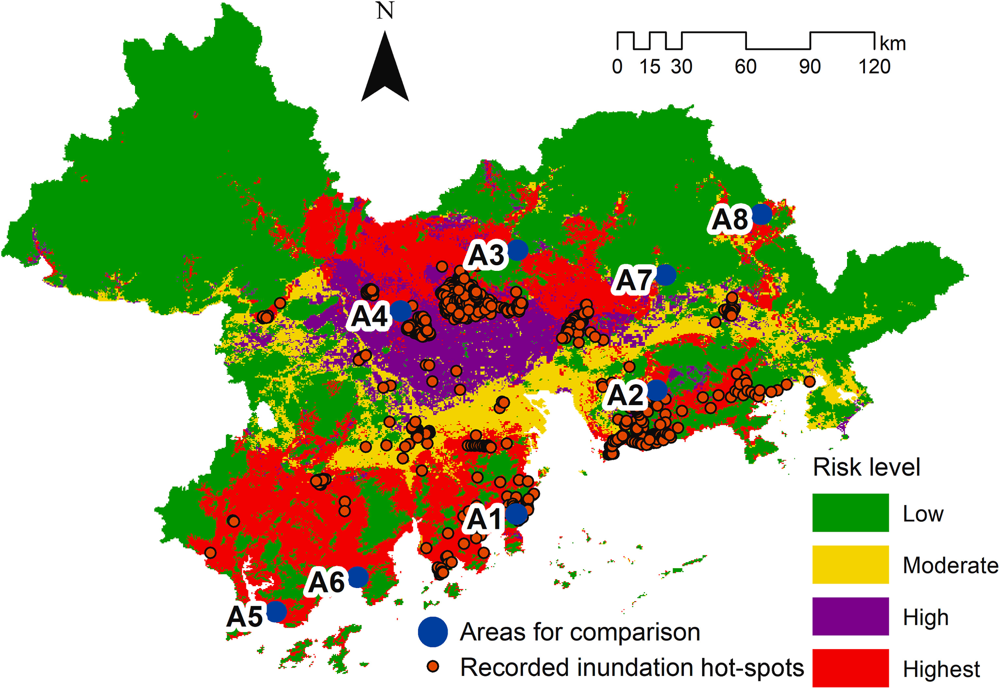

```{r setup, include=FALSE,echo=FALSE}
options(htmltools.dir.version = FALSE)
library(dplyr)
library(readr)
library(readxl)
library(knitr)
```

```{r xaringan-themer, include=FALSE, warning=FALSE}
library(xaringanthemer)
style_duo_accent(primary_color = "#0D5E74", 
                 # secondary_color = "#2881C6",
  header_font_google = google_font("Josefin Sans"),
  text_font_google   = google_font("Montserrat", "300", "300i"),
  code_font_google   = google_font("Fira Mono"),
)
```

```{r xaringan-all, echo=FALSE, warning=FALSE}
library(countdown)
library(xaringan)
library(xaringanExtra)
hook_source <- knitr::knit_hooks$get('source')
knitr::knit_hooks$set(source = function(x, options) {
  x <- stringr::str_replace(x, "^[[:blank:]]?([^*].+?)[[:blank:]]*#<<[[:blank:]]*$", "*\\1")
  hook_source(x, options)
})
xaringanExtra::use_broadcast()
xaringanExtra::use_freezeframe()
xaringanExtra::use_scribble()
#xaringanExtra::use_slide_tone()
xaringanExtra::use_search(show_icon = TRUE, auto_search	=FALSE)
xaringanExtra::use_freezeframe()
xaringanExtra::use_clipboard()
xaringanExtra::use_tile_view()
xaringanExtra::use_panelset()
xaringanExtra::use_editable(expires = 1)
xaringanExtra::use_fit_screen()
xaringanExtra::use_extra_styles(
  hover_code_line = TRUE,         
  mute_unhighlighted_code = TRUE  
)
```

```{r setupbibliography, include=FALSE}
# Code supplied by Andy (see wk2 slides 25-28)
library(RefManageR)
library(knitcitations)
BibOptions(check.entries = FALSE,
           bib.style = "authoryear",
           cite.style = "authoryear",
           style = "markdown",
           hyperlink = TRUE,
           dashed = FALSE,
           no.print.fields=c("doi", "url", "urldate", "issn"))
myBib <- ReadBib("references.bib",
                 # "./Bib.bib", 
                 check = FALSE)
```

class: center, title-slide, middle

background-image: url("img/rain1.jpg")
background-size: cover
background-position: center

# Beijing Floods & Resilience assessment
## CASA0023<br/>Group Project
### Yuqing Liu et al.

### `r format(Sys.time(), "%d/%m/%Y")`

---
class: center, middle

# xaringan

### /ʃaː.'riŋ.ɡan/

---
class: inverse, center, middle

# 出发！

---

# 你好世界

首先从 [Github](https://github.com/yihui/xaringan) 安装 **xaringan** 包：

```{r tidy=FALSE}
if (!requireNamespace("xaringan"))
  remotes::install_github("yihui/xaringan")
```

--

除非你是六指琴魔，否则我建议安装 [RStudio 编辑器](https://www.rstudio.com/products/rstudio/)，它会让你做幻灯片做得飞起。

- 从菜单 `File -> New File -> R Markdown -> From Template -> Ninja Presentation (Simplified Chinese)` 创建一个新文档；

--

- 点击 `Knit` 按钮编译文档；

--

- 或者点击 [RStudio 插件](https://rstudio.github.io/rstudioaddins/)<sup>*</sup> “Infinite Moon Reader” 在 RStudio 里实时预览幻灯片（每次你保存文档的时候，它会自动重新编译）；

.footnote[[*] 如果你看不到模板或者插件，请参见 [#2](https://github.com/yihui/xaringan/issues/2)，你的某些 R 包可能崩坏了，需要重新安装。]

---
background-image: url(`r xaringan:::karl`)
background-position: 50% 50%
class: center, bottom, inverse

### 洛阳亲友如相问，请你不要告诉他

（我是怎么做幻灯片的）

---

# 你好忍者

忍者不会停留在“你好世界”里，要用好这个 R 包，你需要了解：

1. JavaScript 库 [remark.js](https://remarkjs.com) 的语法；

1. **xaringan** 包中的选项;

**xaringan** 将 R Markdown 的查克拉注入了 **remark.js**。浏览器中的幻灯片是 remark.js 渲染出来的，而它的 Markdown 源文档是从 R Markdown 生成的（实际上主要是 **knitr**）。

---

# remark.js

关于 remark.js 的用法可参考它的[首页](https://remarkjs.com)，由于伟大的墙，你可能打不开这个页面（因为里面用了 Google 字体）。不过 [remark.js 的维基页面](https://github.com/gnab/remark/wiki) 已经有足够的信息了，你需要学习：

- 如何创建一页新的片子，主要是 Markdown 语法<sup>*</sup> 以及单页片子的属性设置；

- 如何排版，例如文本对齐；

- 如何设置整个幻灯片的选项（代码高亮样式之类的）；

- 怎样播放幻灯片（快捷键，按 `h` 键基本就知道了）；


.footnote[[*] 它和 Pandoc Markdown 语法不同，不过对做幻灯片而言，简单的语法可能也足够了。]

---
## u


---

### UN Sustainable Development Goals

<div style="display: flex; justify-content: space-around; align-items: flex-start; text-align: center;">
  <figure style="margin: 0 5px; flex-basis: calc(33.3% - 10px);">
    
    <figcaption style="font-size: 18px;">
      <strong>Wastewater treatment, water efficiency enhancement and securing fresh water supply</strong>
      <ul style="list-style-type: disc; padding-left: 20px; margin: 10px 0;">
        <li style="font-size: 18px;">% domestic and industrial wastewater flows safely treated</li>
        <li style="font-size: 18px;">% water bodies with good environmental quality</li>
        <li style="font-size: 18px;">% freshwater withdrawals to available freshwater resources</li>
      </ul>
    </figcaption>
  </figure>
  
  <figure style="margin: 0 5px; flex-basis: calc(33.3% - 10px);">
    
    <figcaption style="font-size: 18px;">
      <strong>Sustainable urbanization, disaster reduction</strong>
      <ul style="list-style-type: disc; padding-left: 20px; margin: 10px 0;">
        <li style="font-size: 18px;">% civil society participation in urban planning and management</li>
        <li style="font-size: 18px;">Population, economic and infrastructure losses associated with disasters</li>
      </ul>
    </figcaption>
  </figure>
  
  <figure style="margin: 0 5px; flex-basis: calc(33.3% - 10px);">
    
    <figcaption style="font-size: 18px;">
      <strong>Climate disaster resilience and planning</strong>
      <ul style="list-style-type: disc; padding-left: 20px; margin: 10px 0;">
        <li style="font-size: 18px;">Sendai Framework for Disaster Risk Reduction</li>
        <li style="font-size: 18px;">Development of local strategies based on national strategies</li>
        <li style="font-size: 18px;">Reporting to the United Nations Framework Convention on Climate Change on information, plans and contributions</li>
      </ul>
    </figcaption>
  </figure>
</div>

---

## Beijing Urban Resilience Strategy—Building spongy, resilient cities

- **Upgrading urban emergency disaster prevention technology**

Research on climate change and underground structures, risk assessment, and optimization of spatial patterns for urban disaster prevention and evacuation and rescue systems.
- **Improvement of emergency rescue capability**

Enhancing emergency rescue and material protection capacity, upgrading emergency medical treatment capacity, and strengthening transportation and communication protection capacity, etc.
- **Programs for cross-sectoral coordination and collaboration in disaster and disease management and development of contingency plans**


<small>Source: Proposals for China's Vision for 2035 (2023)<small>
---
class: inverse, middle, center

# It was not clear what information was used to guide responses.
---

## Follow Sendai Framework for Disaster Risk Reduction 2015-2030

**Address the recommendations of Priority**

- **Understanding disaster risk<br>**
  Monitoring of floods by satellite: Remote sensing technology, unmanned aerial vehicle (UAV) monitoring, etc., and dissemination of disaster risk information through networks

- **Strengthening disaster risk governance to manage disaster risk<br>**
  Across all sectors with defining roles and responsibilities
  
- **Investing in Disaster Risk Reduction for resilience<br>**
  Rational allocation of resources

- **Enhancing disaster preparedness for effective response and to "Build Back Better" in recovery, rehabilitation and reconstruction**


<small>Source: United Nations Office for Disaster Risk Reduction (2019)<small>


---

# Case Study
### London, UK
<div class="justify-text">

London's flood risks are varied and include surface water, river, and tidal flooding. In the 2°C range, without flood management, Expected Annual Damages (EAD) would rise to £2.7-3bn from £2bn today. At 4°C future risk would rise to £3.5-3.9bn. 

</div>

.pull-left[
* Under the Climate Change Act 2008, the UK Government publishes a Climate Change Risk Assessment (CCRA) every five years. 
* A £15 million government funded Natural Flood Management (NFM) programme implemented between 2017 and 2021 to explore effective natural flood management techniques.
]

.pull-right[
```{r echo=FALSE, out.width='100%', fig.align='right'}

```
Image credit: [GOV.UK](https://www.gov.uk/government/news/environment-agency-working-day-and-night-to-reduce-flood-impact--2)
]

---

# Approach

```{r echo=FALSE, out.width='200%', fig.align='center'}
knitr::include_graphics("img/approach.png")
```

---
# Approach

```{r echo=FALSE, out.width='140%', fig.align='center'}
knitr::include_graphics("img/approach1.png")
```

---

# Methodology

```{r echo=FALSE, out.width='140%', fig.align='center'}
knitr::include_graphics("img/approach2.png")
```

---

# Methodology

'Hyperparameter optimization' Machine Learning approach

--

1. Using database of exposure risk and capacity data, split into **Training dataset (70%) and Testing dataset (30%)** set

2. Optimisation of different machine learning models with **hyperparameter optimization** methods: Support Vector Machines (SVM), XGBoost, RF (Random Forest), MLP (Multi-Layer Perceptron), GBDT (Gradient Boosted Decision Tree), CNN (Convolutional Neural Network) 

3. Training, testing, and validating based on recorded **inundation hot-spots**

4. Creation of a **flood resilience map**

5. **Validate** the model using testing set of data


Based off approaches developed by [链接文本](https://www.sciencedirect.com/science/article/pii/S0301479721008720#bib26)[链接文本](https://www.mdpi.com/2072-4292/13/10/1864)


`r Citet(myBib, "taubenbockFloodRisksUrbanized2011", .opts = list(max.names=1, longnamesfirst = FALSE))`, `r Citet(myBib, "mojaddadiEnsembleMachinelearningbasedGeospatial2017", .opts = list(max.names=1, longnamesfirst = FALSE))`, `r Citet(myBib, "tehranyFloodSusceptibilityMapping2014", .opts = list(max.names=1, longnamesfirst = FALSE))`.

???
Presenter Notes

Refs for this section: Taubenböck et al 2011; Mojadaddi et al. 2017; Tehrany et al. 2014; Flood database: Tellman et al. 2021


---

class: inverse, center, middle
### Example output:Density  map

```{r riskmap_img, echo=FALSE, out.width='70%', fig.align='center'}

```


---

class: middle, center

# EO Data: Hazard

```{r hazardtbl, echo=FALSE, message=FALSE}
hazardtbl <- readxl::read_excel("img/eo-source-tables.xlsx", sheet = 1)
knitr::kable(hazardtbl, format = 'html', col.names = c("Purpose", "EO data", "Spatial resolution", "Temporal resolution", "Cost", "Processing"))
```

Significant wave height (`r Citep(myBib, "shahidiTwoNewMethods2020", .opts = list(max.names=1, longnamesfirst = FALSE))`): 
$$
E=\frac{1}{8}pgH^2
$$

???

Data pre-processing except Correction and resampling ?  What is our smallest research scale?

Tidal range is the term describing the vertical change between the maximum high tide and the minimum low tide and is related to tidal flooding.(Tidal range is the difference in height between high tide and low tide.)
Indonesia Agency for Meteorology, Climatology, and Geophysics (BMKG)
NOAA Jason-3  is capable of measuring significant wave height (radar altimeter), sigma naught (sigma0), dry and wet troposphere and ionosphere, which can be used to calculate sea surface height, sea surface height anomalies, and total electron content.
A high rate of Sea Level Rise was designated to correspond to high coastal vulnerability and vice versa. 
Significant Wave Height is a replacement of wave energy, it is the average of the highest one-third (33%) of waves (measured from trough to crest) that occur in a given period. Satellite altimetry was the primary data for extracting the significant wave high.

---

```{r out.width='100%', fig.height=6, eval=require('leaflet')}
library(leaflet)
leaflet() %>% addTiles() %>% setView(-93.65, 42.0285, zoom = 17)
```

---

```{r eval=require('DT'), tidy=FALSE}
DT::datatable(
  head(iris, 10),
  fillContainer = FALSE, options = list(pageLength = 8)
)
```

---

# 一些小技能

- “Infinite Moon Reader”插件默认情况下会锁住你的 R 进程，有它没你，有你没它。你可以设置一个选项，让它一边儿凉快去：

    ```r
    options(servr.daemon = TRUE)
    ```
    
    你可以把这个设置写在 `~/.Rprofile` 文件中，这样你将来所有 R 进程都不会被这个插件挡住去路。
    
    这事情背后的魔法在 [**servr**](https://github.com/yihui/servr) 包中。

--

- 别忘了玩一下 `yolo` 选项，如：

    ```yaml
    output:
      xaringan::moon_reader:
        yolo: 3
    ```

    它会随机显示 Karl Broman 的照片；这里地方太小，写不下故事的来龙去脉。

---

# 一些小技能

- `nature` 下面的 `autoplay` 选项可以用来自动播放幻灯片，它的取值是毫秒，例如每 30 秒播放一张片子：

    ```yaml
    output:
      xaringan::moon_reader:
        nature:
          autoplay: 30000
    ```

--

- `nature` 下面的 `countdown` 选项可以为每一页幻灯片添加一个（倒数）计时器，取值同样为毫秒，例如每一页片子都用 60 秒倒计时：

    ```yaml
    output:
      xaringan::moon_reader:
        nature:
          countdown: 60000
    ```

---

# 一些小技能

- 一页片子可以分割成一步步播放，参见[这个示例](https://slides.yihui.org/xaringan/incremental.html)。

- 选项 `highlightLines: true` 可以让以 `*` 开头或者双重大括号 `{{ }}` 里面的代码被高亮出来；

    ```yaml
    output:
      xaringan::moon_reader:
        nature:
          highlightLines: true
    ```

    下一页我们举两个栗子。

---

# 一些小技能

.pull-left[
以 `*` 开头的代码：

    ```r
    if (TRUE) {
    ** message("敲黑板！划重点！")
    }
    ```
输出：
```r
if (TRUE) {
* message("敲黑板！划重点！")
}
```

因为它不是合法的 R 代码，所以不能作为 R 代码段来写，只能用三个反引号直接跟 r（就知道你没听懂）。
]

.pull-right[
用 `{{}}` 包裹的代码：

````
`r ''````{r tidy=FALSE}
if (TRUE) {
*{{ message("敲黑板！划重点！") }}
}
```
````

输出：
```{r tidy=FALSE}
if (TRUE) {
{{ message("敲黑板！划重点！") }}
}
```

这是合法的 R 代码，所以你可以真的运行它。
]

---

# CSS（层叠样式表）

`xaringan::moon_reader` 的所有选项中，最强的魔法在 `css` 选项上，它是自定义幻灯片样式的关键。如果你不懂 CSS 的话，我强烈建议你学习一些 CSS 的基础知识。

对中文幻灯片，**xaringan** 包中的默认 CSS 文件在[这里](https://github.com/yihui/xaringan/blob/master/inst/rmarkdown/templates/xaringan_zh-CN/skeleton/zh-CN.css)，你可以在它的基础上改装，也可以直接定义全新的 CSS 样式。

---

# CSS（层叠样式表）

举个栗子。比如你想将一段文字的颜色改为红色，你可以定义一个 CSS 类，如：

```css
.red {
  color: #FF0000;
}
```

我们把这段代码保存在一个 CSS 文件中，如 `extra.css`（假设它跟你的 R Markdown 文件在同一文件夹下），然后通过 `css` 选项将它引入：

```yaml
output:
  xaringan::moon_reader:
    css: ["zh-CN.css", "extra.css"]
```

其中 `zh-CN.css` 是本包已经为你提供的 CSS 样式文件（你可选择用或不用）。

现在在 R Markdown 中你就可以用 `.red[]` 来标记一段文字为红色，如 `.red[我是红色的]`。

---

# CSS（层叠样式表）

如果想在墙内用 Google 字体的话，可以试试这个 [google-webfonts-helper](https://google-webfonts-helper.herokuapp.com/fonts) 应用，它会把字体下载到本地并生成相应的 CSS 文件。也可以考虑 360 的 [CDN 服务](http://libs.useso.com)。

可惜中文不像英文，没有很新奇酷炫的网络字体，只能靠你电脑上的字体硬撑了。

---
class: inverse, middle, center
background-image: url(https://upload.wikimedia.org/wikipedia/commons/3/39/Naruto_Shiki_Fujin.svg)
background-size: contain

# 火影忍者

---
background-image: url(https://upload.wikimedia.org/wikipedia/commons/b/be/Sharingan_triple.svg)
background-size: 100px
background-position: 90% 8%

# 写轮眼

**xaringan** 这个名字来源于火影中的写轮眼 **Sharingan**。<sup>1</sup> 写轮眼有两大能力：

- 洞察眼

- 催眠眼

其实做演示就是将自己的洞见传递给听众；好的演讲通常有催眠效果，因为它可以深度震撼人心。<sup>2,3</sup>

.footnote[
[1] 我把 Sh 换成 X 了，因为几乎没有一个歪果仁读对过我的姓。当然主要原因还是 xaringan 搜索起来更容易被搜到。

[2] 糟糕的演讲也可以催眠听众，但显然这两种催眠完全不同。

[3] 我之所以选择了 remark.js 框架，就是因为它可以设置背景图。对我而言，在一页片子上整页显示一幅图最能表达震撼的视觉效果，现有的 R Markdown 幻灯片框架都缺乏这个功能，不开森。当时我发现 remark.js 之后真的是激动地不要不要的，等了一个月才抽出空来把这个包写出来。
]

---

# 火影术语

简单介绍一下这个包里那些奇怪的术语的由来：

- [写轮眼](https://naruto.fandom.com/wiki/Sharingan)（包名，已解释）

- [月读](https://naruto.fandom.com/wiki/Moon_Reader)（我希望这个 R Markdown 格式 `moon_reader` 能将听众控制在幻象中）

- [查克拉](https://naruto.fandom.com/wiki/Chakra)（月读的参数之一 `chakra`，意思是 remark.js 的路径，它是支撑幻灯片的核心动力）

- [性质变化](https://naruto.fandom.com/wiki/Nature_Transformation)（月读的参数之一 `nature`，意思是通过设置选项改变查克拉的性质）

- [无限月读](https://naruto.fandom.com/wiki/Infinite_Tsukuyomi)（函数 `infinite_moon_reader()` 开启一个服务器不断刷新更新后的幻灯片，RStudio 插件背后对应的就是这个函数）

- [通灵术](https://naruto.fandom.com/wiki/Summoning_Technique)（`summon_remark()` 从网络上把 remark.js 通灵到本地）

月读这个忍术有点邪恶，不过你就当不知道吧。

---

# 结印

使用本包单手就可以结印，按键 `h` 或者 `?` 之后就可以看见所有结印手势，例如 `p` 进入演讲者模式（可看见写给自己的注释，比如提醒自己要讲的笑话），`c` 复制幻灯片到新窗口；演讲时可以在自己面前的屏幕上显示演讲者模式，把新窗口中正常的幻灯片拖到大屏幕投影上给观众看。

.center[]

???

嗯，我们来讲一个不容易看懂的冷笑话。


---

class: center, middle

# 蟹蟹

本幻灯片由 R 包 [**xaringan**](https://github.com/yihui/xaringan) 生成；

查克拉来自于 [remark.js](https://remarkjs.com)、[**knitr**](https://yihui.org/knitr)、以及 [R Markdown](https://rmarkdown.rstudio.com)。

---

# Expected Outcome

Urban waterlogging monitoring and early warning  system platform

.center[]

---

# Risks and Limitations

.pull-left[
**Risks**

-  Additional high expenses
-  Technical errors or deficiencies
-  Adverse effects from the surrounding environment
-  Uncertainty due to extreme weather events
-  Policy and legal complexity
-  Management and coordination

]

.pull-right[
**Mitigation**
-  Setting aside funds
-  Implement regular project inspections and maintenance
-  Consider ecosystem protection in project design
-  Strengthen cross-sectoral and inter-regional coordination and cooperation
-  Develop detailed contingency plans
]

---


# Summary

This project extracts and evaluates key information on the flooding situation in Beijing by integrating multi-source remote sensing data.

Benefits of the project:
- Provide accurate disaster information and technical support. 

- Provide a scientific basis for emergency response following floods.

- Raise the disaster awareness and coping capacity of urban residents.

- Promote sustainable urban development.


